# 📊 Diagramas do Projeto — MeuBolso

---

# 📐 1. Diagrama de Contexto (C4 — Nível 1)

---

## 🎯 Objetivo

Mostrar o sistema como um todo e suas interações externas.

---

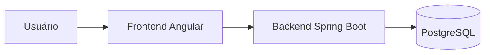

---

## 📌 Interpretação

* Usuário interage apenas com o frontend
* Frontend consome API REST
* Backend concentra toda lógica
* Banco armazena estado

---

# 🧩 2. Diagrama de Containers (C4 — Nível 2)

---

## 🎯 Objetivo

Detalhar os principais blocos executáveis do sistema.

---

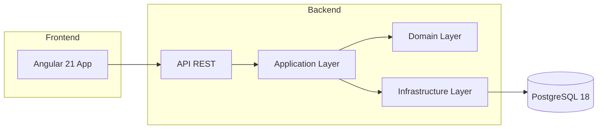

---

## 📌 Interpretação

* separação clara por camadas
* domínio isolado
* infraestrutura desacoplada

---

# 🧠 3. Diagrama de Contextos (DDD)

---

## 🎯 Objetivo

Mostrar os bounded contexts do sistema.

---

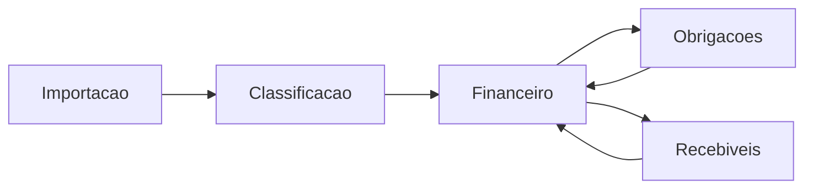

---

## 📌 Contextos

* Core Financeiro
* Gestão de Obrigações
* Gestão de Recebíveis
* Importação
* Classificação

---

---

# 🧱 4. Diagrama de Módulos do Backend

---

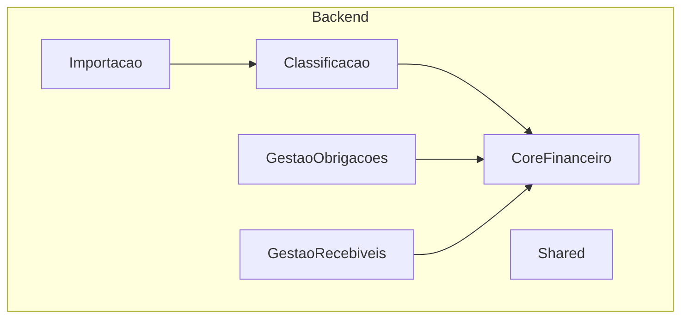

---

---

# 🔄 5. Fluxo de Caixa (Visão funcional)

---

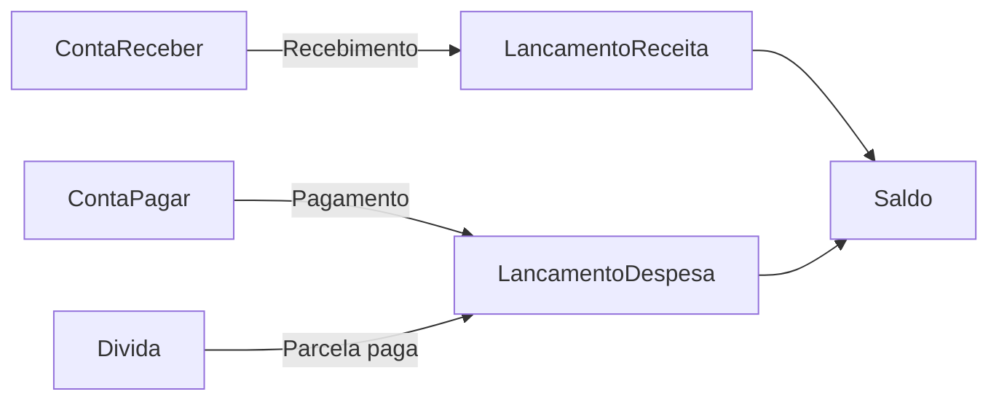

---

---

# 📥 6. Fluxo de Importação

---

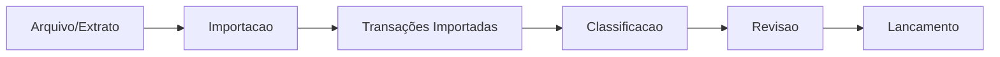

---

---

# 🧠 7. Fluxo de Classificação Inteligente

---

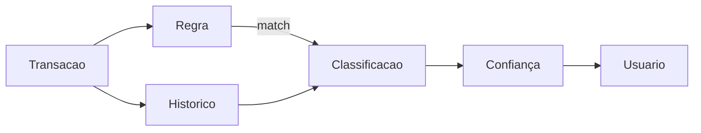

---

---

# 🔐 8. Fluxo de Autenticação

---

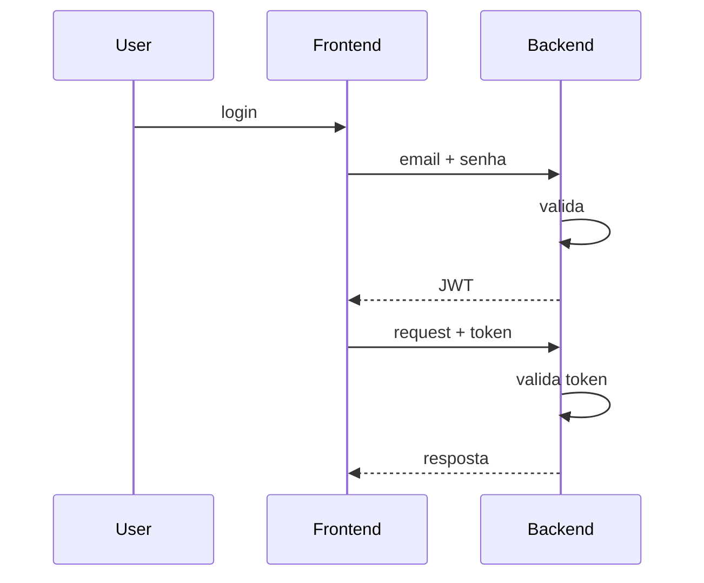

---

---

# 🧾 9. Fluxo de Conta a Pagar

---

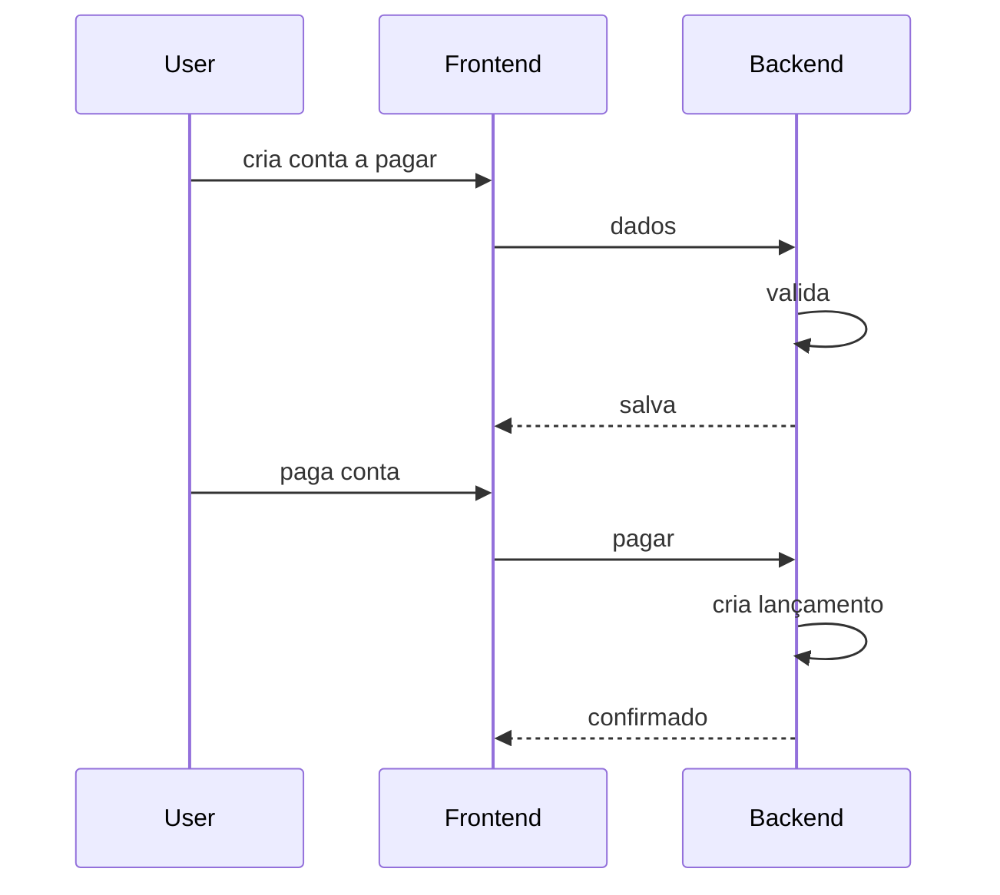

---

---

# 📊 10. Fluxo de Conta a Receber

---

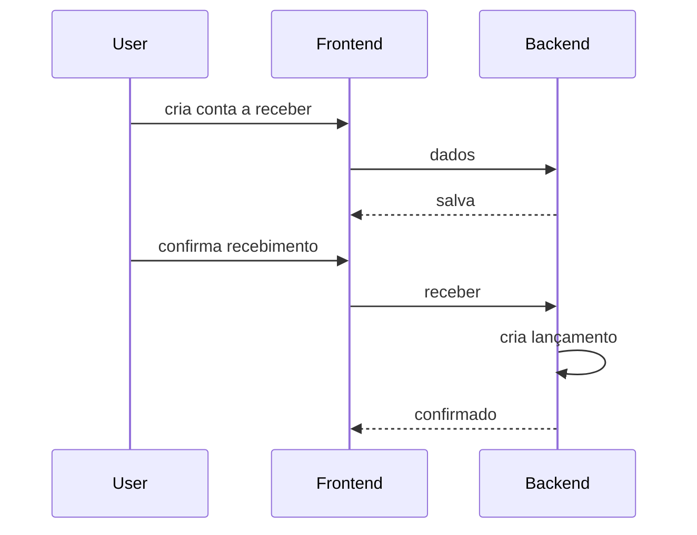

---

---

# 🗄️ 11. Diagrama de Entidades

---

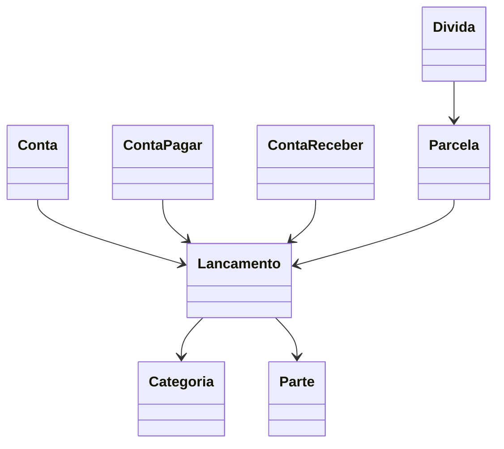

---

---

# ⚙️ 12. Diagrama de Infraestrutura (Docker)

---

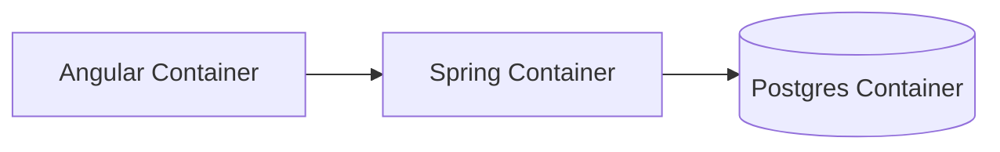

---