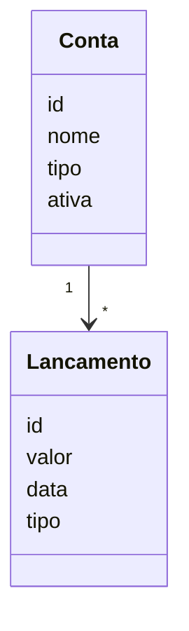
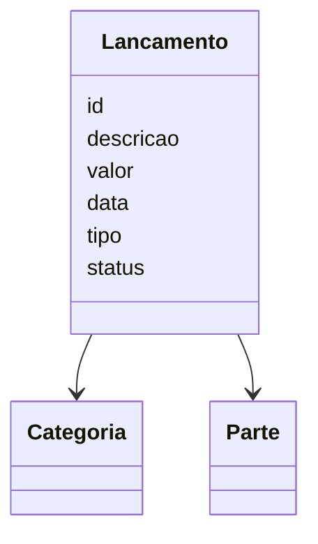
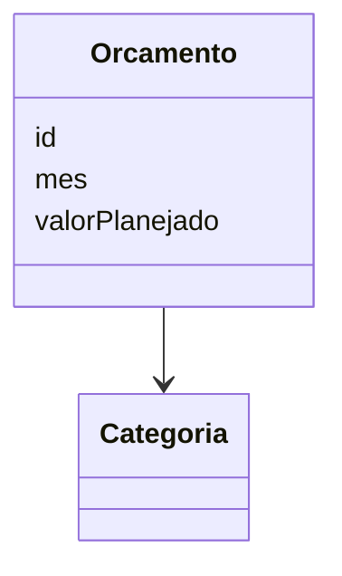
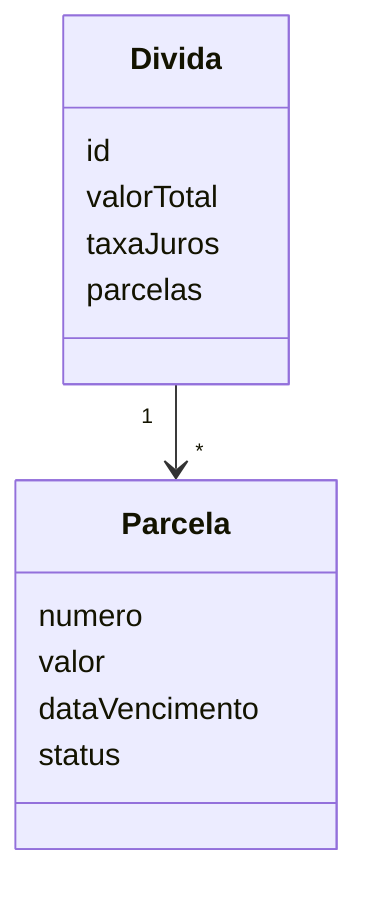
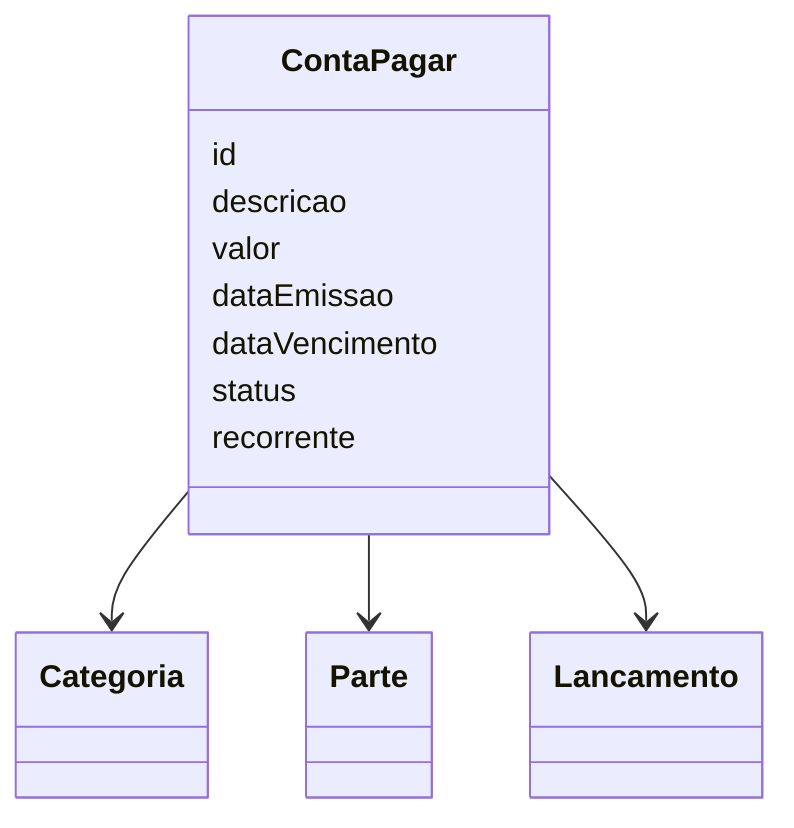
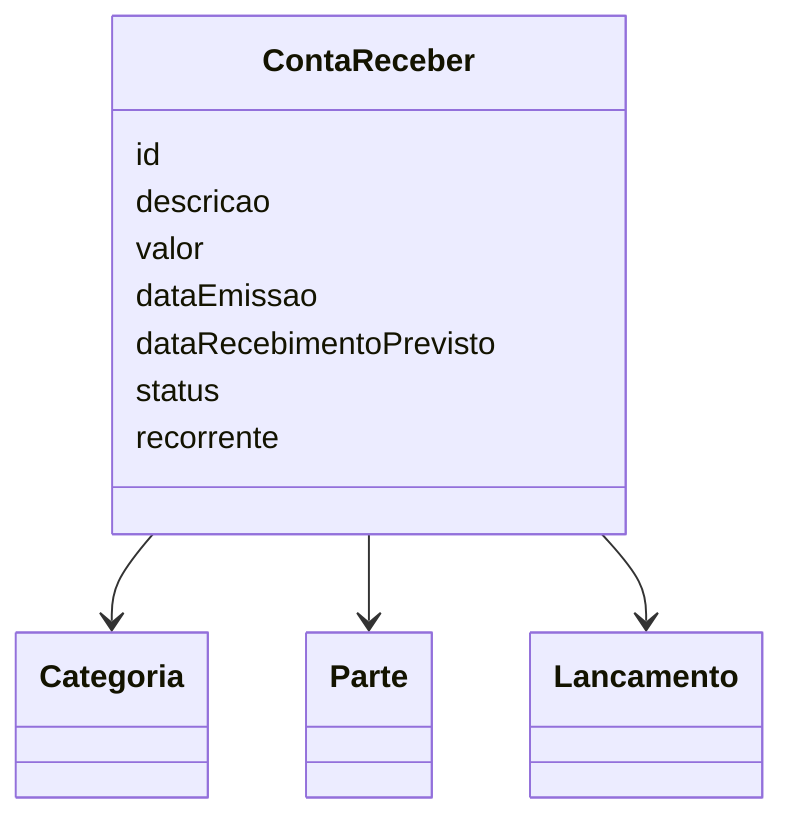
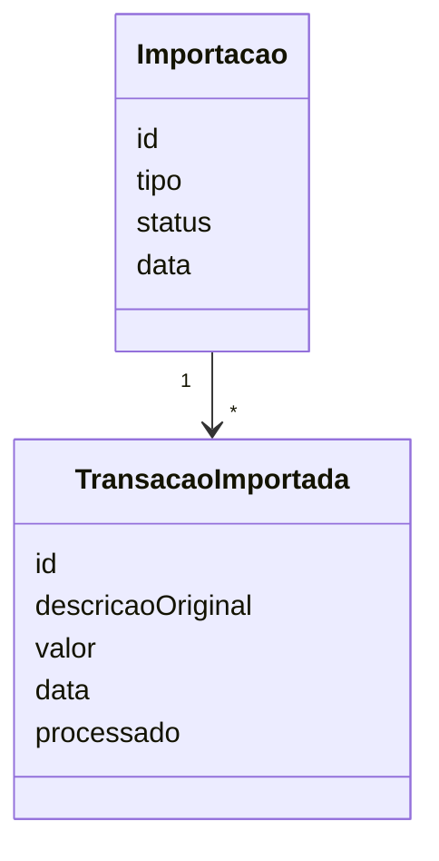
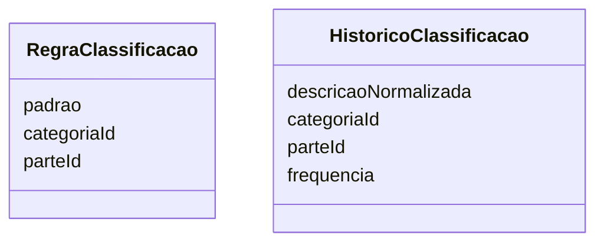
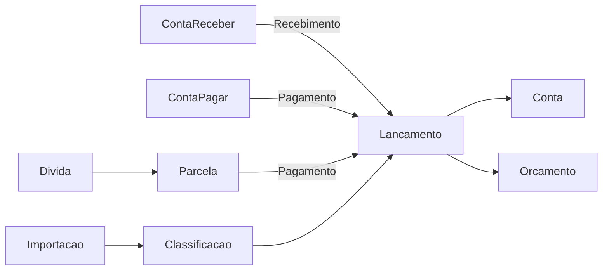

# Modelo de Domínio

---

## 1. Visão Geral do Domínio

O sistema é dividido em 5 grandes contextos:

- Core Financeiro
- Gestão de Obrigações
- Gestão de Recebíveis
- Importação de Dados
- Inteligência de Classificação

---

## 2. Bounded Contexts

### 2.1 Core Financeiro

Responsável por:

- Contas
- Lançamentos
- Categorias
- Orçamento
- Dívidas

### 2.2 Gestão de Obrigações

Responsável por:

- Contas a pagar
- Recorrência de despesas
- Controle de vencimentos
- Conversão em lançamentos

### 2.3 Gestão de Recebíveis

Responsável por:

- Contas a receber
- Recorrência de receitas
- Previsão de entradas
- Controle de recebimentos

### 2.4 Importação de Dados

Responsável por:

- Entrada de dados externos
- Normalização
- Deduplicação
- Staging

### 2.5 Inteligência de Classificação

Responsável por:

- Inferência de categoria
- Inferência de contraparte
- Aprendizado

---

## 3. Agregados

### 3.1 Agregado: Conta



#### Regras

- Uma conta pode ter vários lançamentos.
- Um lançamento sempre pertence a uma conta (ou duas, no caso de transferência).
- Conta pode ser desativada, mas não deletada.

---

### 3.2 Agregado: Lançamento



#### Regras Formais

##### Regra 1 — Tipo

```
Se valor > 0  →  tipo = RECEITA
Se valor < 0  →  tipo = DESPESA
```

##### Regra 2 — Transferência

```
Se tipo = TRANSFERENCIA:
  - deve ter contaOrigem
  - deve ter contaDestino
  - categoria deve ser nula
```

##### Regra 3 — Status

```
PENDENTE   → ainda não impacta saldo
CONFIRMADO → impacta saldo
```

##### Regra 4 — Imutabilidade parcial

```
Após CONFIRMADO:
  - valor não pode ser alterado
  - conta não pode ser alterada
```

---

### 3.3 Agregado: Orçamento



#### Regras

- Um orçamento é definido por (mes, categoria).
- Não pode existir duplicidade (mes + categoria).
- Deve permitir comparação com o realizado.

---

### 3.4 Agregado: Dívida



#### Regras Formais

##### Regra 1 — Integridade

```
Soma(parcelas) = valorTotal (± juros)
```

##### Regra 2 — Status da parcela

```
Se dataVencimento < hoje e status != PAGO:
  status = ATRASADO
```

##### Regra 3 — Pagamento

```
Ao pagar parcela:
  - gera um Lancamento
  - vincula lancamentoId
```

---

### 3.5 Agregado: ContaPagar



#### Regras Formais

##### Regra 1 — Ciclo de vida

```
PENDENTE  → ainda não pago
PAGO      → pagamento realizado
ATRASADO  → vencido e não pago
```

##### Regra 2 — Geração de lançamento

```
Ao pagar uma ContaPagar:
  - deve gerar um Lancamento
  - deve vincular lancamentoId
```

##### Regra 3 — Competência

```
A despesa pertence à dataEmissao,
independente da data de pagamento.
```

##### Regra 4 — Categoria obrigatória

```
Toda ContaPagar deve ter categoria.
```

##### Regra 5 — Valor imutável após pagamento

```
Após status = PAGO:
  - valor não pode ser alterado
```

##### Regra 6 — Status automático

```
Se dataVencimento < hoje e status != PAGO:
  status = ATRASADO
```

##### Regra 7 — Recorrência

```
Se recorrente = true:
  sistema deve gerar nova ContaPagar automaticamente
```

#### Distinção formal: ContaPagar vs Dívida

```
ContaPagar:
  - obrigação de curto prazo
  - ligada a consumo/serviço
  - pode ser recorrente
  - sem estrutura financeira complexa

Divida:
  - obrigação financeira estruturada
  - possui parcelas
  - pode ter juros
  - representa financiamento
```

---

### 3.6 Agregado: ContaReceber



#### Regras Formais

##### Regra 1 — Ciclo de vida

```
PENDENTE  → ainda não recebido
RECEBIDO  → valor recebido
ATRASADO  → passou da data prevista
```

##### Regra 2 — Conversão em lançamento

```
Ao receber:
  - deve gerar um Lancamento (RECEITA)
  - deve vincular lancamentoId
```

##### Regra 3 — Competência

```
A receita pertence à dataEmissao.
```

##### Regra 4 — Categoria obrigatória

```
Toda ContaReceber deve ter categoria.
```

##### Regra 5 — Imutabilidade

```
Após status = RECEBIDO:
  - valor não pode ser alterado
```

##### Regra 6 — Status automático

```
Se dataRecebimentoPrevisto < hoje e status != RECEBIDO:
  status = ATRASADO
```

##### Regra 7 — Recorrência

```
Se recorrente = true:
  sistema deve gerar nova ContaReceber automaticamente
```

---

## 4. Contexto de Importação

### 4.1 Agregado: Importação



#### Regras Formais

##### Regra 1 — Staging obrigatório

```
Nenhuma transação importada pode virar lançamento direto.
```

##### Regra 2 — Deduplicação

```
Não pode existir duas transações com o mesmo:
  (data + valor + descricaoNormalizada)
```

##### Regra 3 — Processamento

```
processado = true  →  já virou lançamento
```

---

## 5. Contexto de Classificação

### 5.1 Agregado: Classificação



#### Regras Formais

##### Regra 1 — Prioridade

```
Regras explícitas têm prioridade sobre histórico.
```

##### Regra 2 — Aprendizado

```
Ao corrigir uma classificação:
  - atualizar histórico
  - aumentar frequência
```

##### Regra 3 — Confiança

```
confiança = função(
  matchRegra,
  similaridade,
  frequência
)
```

---

## 6. Integração entre Contextos



### Modelo Conceitual Consolidado

```
ContaReceber  →  entrada futura
ContaPagar    →  saída futura
Divida        →  obrigação estruturada
Lancamento    →  realizado
```

> **Regra crítica:** ContaReceber NÃO é receita realizada. ContaPagar NÃO é despesa realizada. Apenas Lancamento impacta saldo.

### Fórmula de Projeção de Fluxo de Caixa

```
Saldo futuro = saldo atual
             + contas a receber
             - contas a pagar
```

---

## 7. Invariantes Globais (CRÍTICO)

Essas regras **nunca** podem ser quebradas:

| # | Invariante |
|---|------------|
| 1 | Saldo da conta = soma dos lançamentos CONFIRMADOS |
| 2 | Transações importadas não podem ser perdidas |
| 3 | Toda parcela paga deve ter um lançamento associado |
| 4 | Toda ContaPagar paga deve ter um lançamento associado |
| 5 | Toda ContaReceber recebida deve ter um lançamento associado |
| 6 | ContaPagar não pode impactar saldo diretamente |
| 7 | ContaReceber não pode impactar saldo diretamente |
| 8 | Toda despesa deve ter categoria (exceto transferência) |

---

## 8. Eventos de Domínio

### Core Financeiro

```
LancamentoCriado
LancamentoConfirmado
```

### Gestão de Obrigações

```
ContaPagarCriada
ContaPagarPaga
ContaPagarVencida
DividaCriada
ParcelaPaga
```

### Gestão de Recebíveis

```
ContaReceberCriada
ContaReceberRecebida
ContaReceberAtrasada
```

### Importação e Classificação

```
ImportacaoConcluida
TransacaoClassificada
```